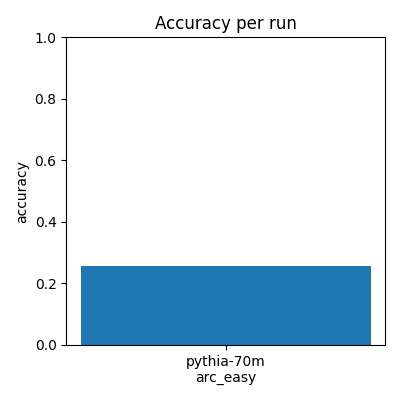

# Findings: Scaling Ladder Eval Observatory

A small, end-to-end LLM evaluation system: perplexity-from-scratch and five
downstream benchmarks across the Pythia scaling ladder (70M–1B), with parity
checks against lm-evaluation-harness and a prompt-sensitivity study.

## Sprint 1 — Walking skeleton

The first end-to-end slice: Pythia-70m on 200 ARC-Easy test examples,
`loglik_mc` evaluator (`arc_easy/mc_letter_v1`, 0-shot lettered options),
accuracy metric, stored in SQLite, regenerated from the DB with
`ladderctl figures`.

*Figure generated by `ladderctl figures` from `ladder.db` alone. Sprint 1's
figure has one bar per run; later sprints replace this with the scaling
curves described below.*

**Early prompt-sensitivity signal.** Pythia-70m scored 25.5% on this
lettered-option format — close to ARC-Easy's ~25–28% chance rate for
4-choice items, not the high-30s–40s% typically reported for this model. Per-example inspection showed the model's argmax over lettered continuations
(` A`/` B`/` C`/` D`) is close to arbitrary: after the `Answer:` cue, an
untuned 70M base model's top next-token prediction is whitespace, not a
letter. Rescoring the same examples with the `option_text` continuation
style (scoring full answer text instead of a bare letter) recovered most of
the gap (32% on a 50-example spot check). This is an early instance of
exactly the effect the prompt-sensitivity study (Sprint 4) exists to
quantify systematically across the whole ladder — flagged here rather than
tuned away, since Sprint 1's job was to prove the pipeline, not pick the
best-looking prompt.

## Scaling curves (placeholder — later sprint)

Log-params vs. accuracy for all five benchmarks, with bits-per-byte on a twin
axis: perplexity improving smoothly across the ladder while "emergent"
benchmarks (MMLU, GSM8K) stay at chance and "smooth" benchmarks (LAMBADA,
ARC-Easy, HellaSwag) track it.

## Parity vs. lm-evaluation-harness (placeholder — later sprint)

Agreement rate and a table of every discrepancy vs. lm-eval-harness on
ARC-Easy and HellaSwag, each categorized and root-caused; zero left
unexplained.

## Prompt sensitivity (placeholder — later sprint)

Accuracy deltas across 2–3 prompt formats per multiple-choice benchmark,
across the ladder.

## Future work

Out of scope for this project (see `project_summary.md`): training any
models, the OLMo suite, Paloma per-domain PPL, a dashboard or web service, a
third parity framework, and prompt-variant/few-shot sweeps beyond what's
already scoped.
