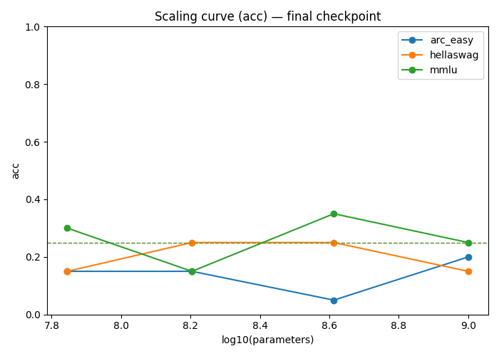
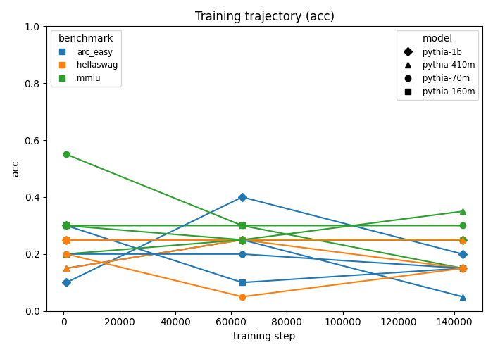

# Findings: Scaling Ladder Eval Observatory

A small, end-to-end LLM evaluation system: perplexity-from-scratch and five
downstream benchmarks across the Pythia scaling ladder (70M–1B), with parity
checks against lm-evaluation-harness and a prompt-sensitivity study.

## Sprint 1 — Walking skeleton

The first end-to-end slice: Pythia-70m on 200 ARC-Easy test examples,
`loglik_mc` evaluator (`arc_easy/mc_letter_v1`, 0-shot lettered options),
accuracy metric, stored in SQLite, regenerated from the DB with
`ladderctl figures`.

*Figure generated by `ladderctl figures` from `ladder.db` alone. Sprint 1's
figure has one bar per run; later sprints replace this with the scaling
curves described below.*

**Early prompt-sensitivity signal.** Pythia-70m scored 25.5% on this
lettered-option format — close to ARC-Easy's ~25–28% chance rate for
4-choice items, not the high-30s–40s% typically reported for this model. Per-example inspection showed the model's argmax over lettered continuations
(` A`/` B`/` C`/` D`) is close to arbitrary: after the `Answer:` cue, an
untuned 70M base model's top next-token prediction is whitespace, not a
letter. Rescoring the same examples with the `option_text` continuation
style (scoring full answer text instead of a bare letter) recovered most of
the gap (32% on a 50-example spot check). This is an early instance of
exactly the effect the prompt-sensitivity study (Sprint 4) exists to
quantify systematically across the whole ladder — flagged here rather than
tuned away, since Sprint 1's job was to prove the pipeline, not pick the
best-looking prompt.

## Sprint 2 — Scaling ladder + resumable sweeps

`sweeps/main.yaml` declares the full MC grid: `pythia-{70m,160m,410m,1b}` ×
`{step1000, step64000, main}` × `{arc_easy, hellaswag, mmlu}`, capped at 500
examples per run (36 runs total). `ladderctl sweep run sweeps/main.yaml`
executes it sequentially grouped by (model, revision) so each checkpoint
loads once; killing the process and rerunning the same command resumes from
whatever is already `done` in the DB, with zero recomputation on the
already-completed runs (proven offline in `tests/test_sweep.py`'s
interrupt-and-resume test — a partial sweep executed, then the full spec
rerun against the same DB, asserting no duplicate rows and no new client
calls for the completed portion).

`ladderctl figures` now additionally regenerates two figures straight from
`ladder.db`, with no other input:

*Log10(parameters) vs. `acc`, one line per benchmark, evaluated at each
model's final checkpoint (`main`). Dashed lines mark the 4-choice chance
rate (0.25) for each benchmark that has one.*

*`acc` vs. training step, one line per (model, benchmark) pair, across the
three swept checkpoints (`step1000`, `step64000`, `main`).*

**Status: mechanism proven, real ladder not yet run.** Both figures above
were generated by running `sweeps/main.yaml`'s exact grid (4 model sizes × 3
checkpoints × 3 benchmarks) through `sweep run` → `figures` with the Pythia
model_ids temporarily backed by `DummyClient` instead of `HFClient` — the
same offline-only pattern the test suite uses
(`tests/test_cli_integration.py::test_mini_sweep_then_figures_render_from_db`
covers the smaller 2×2×2 case as an automated regression test). The synthetic
scores are random by construction, so the flat/noisy lines above are
expected and carry no signal — they demonstrate the figures render correctly
from real sweep-shaped DB contents, not real scaling behavior.
`sweeps/main.yaml` has not yet been executed against real Pythia checkpoints
on hardware; that run (and the first real scaling observations — which
benchmarks rise smoothly, where MMLU sits relative to the 0.25 chance line)
is the next step once GPU time is available, per the sprint's deliverables.

bits-per-byte is not plotted yet — perplexity-from-scratch (WikiText-103 /
C4) is Sprint 3 scope; the twin-axis PPL/accuracy comparison described below
waits for that.

## PPL vs. accuracy across the ladder (placeholder — later sprint)

Log-params vs. accuracy for all five benchmarks, with bits-per-byte on a twin
axis: perplexity improving smoothly across the ladder while "emergent"
benchmarks (MMLU, GSM8K) stay at chance and "smooth" benchmarks (LAMBADA,
ARC-Easy, HellaSwag) track it.

## Parity vs. lm-evaluation-harness (placeholder — later sprint)

Agreement rate and a table of every discrepancy vs. lm-eval-harness on
ARC-Easy and HellaSwag, each categorized and root-caused; zero left
unexplained.

## Prompt sensitivity (placeholder — later sprint)

Accuracy deltas across 2–3 prompt formats per multiple-choice benchmark,
across the ladder.

## Future work

Out of scope for this project (see `project_summary.md`): training any
models, the OLMo suite, Paloma per-domain PPL, a dashboard or web service, a
third parity framework, and prompt-variant/few-shot sweeps beyond what's
already scoped.
